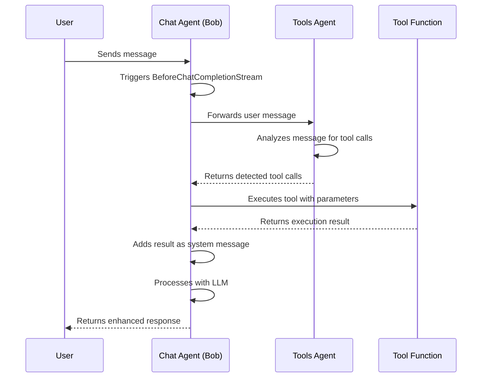

# Sub-Agent with Tool Demo

The cookbook example [`17-sub-agent-with-tool`](cookbook/17-sub-agent-with-tool/main.go) demonstrates how two agents can collaborate to handle user requests with tool execution capabilities.

## Architecture Overview

This demo showcases a sophisticated multi-agent system where:

1. **Chat Agent (Bob)** - The main conversational agent that interacts with users
2. **Tools Agent** - A specialized agent responsible for detecting and executing tool calls

## Key Features

- **Tool Detection Pipeline**: The tools agent automatically detects when tool calls are needed based on user input
- **Automatic Tool Execution**: Tool calls are executed and results are injected into the conversation context
- **HTTP Server Integration**: The chat agent runs an HTTP server for external API interactions
- **Lifecycle Hooks**: Uses `BeforeChatCompletionStream` and `AfterChatCompletionStream` for processing pipeline
- **Message Management**: Comprehensive message tracking and display throughout the conversation flow

## Agent Configuration

### Chat Agent (Bob)
- Model: `ai/qwen2.5:latest`
- Temperature: 0.8 (creative responses)
- HTTP Server: Port 5050
- Logging: Error level
- System Instructions: Basic helpful assistant persona

### Tools Agent
- Model: `ai/qwen2.5:latest`  
- Temperature: 0.0 (deterministic tool detection)
- Parallel Tool Calls: Disabled
- Available Tools: `hello` function for greeting users

## Collaboration Flow

1. **User Input**: User sends a message to the chat agent
2. **Tool Detection**: Before generating a response, the chat agent forwards the message to the tools agent
3. **Tool Analysis**: The tools agent analyzes the message and detects if any tools should be called
4. **Tool Execution**: If tools are detected, they are executed with the appropriate parameters
5. **Context Injection**: Tool results are added as system messages to provide context
6. **Response Generation**: The chat agent generates a response with the enhanced context
7. **Message Tracking**: All messages are tracked and displayed throughout the process

This architecture demonstrates how specialized agents can work together to create more capable AI systems while maintaining clear separation of concerns.
